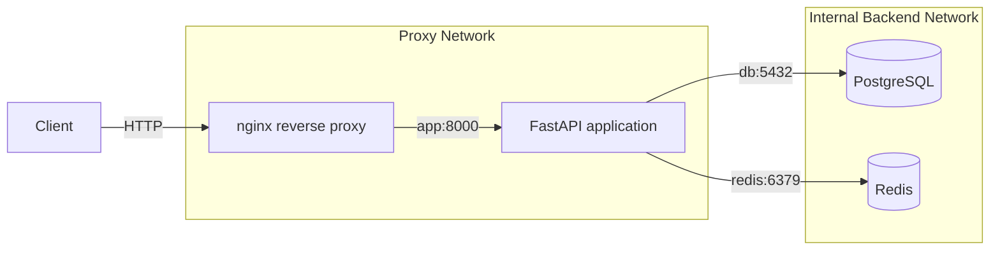

# AllSafe

AllSafe is a containerized passive DNS reconnaissance API built with FastAPI.

The application accepts a domain name, resolves its DNS `A` records, caches results in Redis, and stores scan history in PostgreSQL. nginx acts as the only externally exposed entry point.

The main purpose of this project is to demonstrate containerization, service networking, persistence, caching, reverse proxying, health checks, multi-stage builds, and non-root container execution.

## Current Features

- FastAPI REST API
- Asynchronous DNS resolution with `dnspython`
- PostgreSQL scan history
- Redis cache-aside pattern
- Redis TTL-based cache expiration
- nginx reverse proxy
- Docker Compose orchestration
- Docker health checks
- Named Docker volumes
- Separate proxy and backend networks
- Multi-stage Docker image
- Non-root application container
- Environment-based configuration

TLS certificate inspection and HTTP security-header grading are planned for a later application version. The current Phase 1 implementation focuses on DNS scanning and production-style container infrastructure.

## Architecture



Only nginx publishes a port to the host.

The FastAPI application, PostgreSQL, and Redis are accessible only through Docker networks.

## Request Flow

### New scan

```text
Client
  |
  v
nginx
  |
  v
FastAPI
  |
  +--> Check Redis
           |
           +--> Cache hit: return cached DNS result
           |
           +--> Cache miss
                    |
                    +--> Resolve DNS
                    +--> Save result in Redis
                    +--> Save scan history in PostgreSQL
                    +--> Return result
```

### Stored-domain lookup

The `/check/{domain}` endpoint first checks Redis.

If the result is not cached, the application reads the latest matching record from PostgreSQL and adds it back to Redis.

## Technology Stack

| Component | Technology |
|---|---|
| API | FastAPI |
| Application server | Uvicorn |
| DNS resolution | dnspython |
| Database | PostgreSQL |
| ORM | SQLAlchemy async |
| Database driver | asyncpg |
| Cache | Redis |
| Reverse proxy | nginx |
| Migrations | Alembic |
| Containerization | Docker |
| Orchestration | Docker Compose |

## Project Structure

```text
.
├── .dockerignore
├── .env.example
├── .gitignore
├── Dockerfile
├── README.md
├── alembic
│   ├── README
│   ├── env.py
│   ├── script.py.mako
│   └── versions
├── alembic.ini
├── app
│   ├── __init__.py
│   ├── db
│   │   ├── __init__.py
│   │   ├── db.py
│   │   └── models.py
│   ├── main.py
│   ├── redis
│   │   ├── __init__.py
│   │   └── redis.py
│   └── routers
│       ├── __init__.py
│       └── scanner.py
├── compose.yaml
├── nginx
│   └── default.conf
└── requirements.txt
```

## Requirements

Install:

- Docker
- Docker Compose
- Git

No local Python installation is required to run the containerized stack.

## Local Setup

Clone the repository:

```bash
git clone <repository-url>
cd allsafe
```

Create the local environment file:

```bash
cp .env.example .env
```

Review and change the values inside `.env`.

Example:

```dotenv
# PostgreSQL
DB_HOST=db
DB_PORT=5432
DB_NAME=allsafe
DB_USER=allsafe
DB_PASSWORD=change-me

# Redis
REDIS_HOST=redis
REDIS_PORT=6379

# nginx
NGINX_HOST_PORT=8080
NGINX_PORT=80
```

Do not commit the real `.env` file.

## Start the Application

Build the application image and start all services:

```bash
docker compose up --build -d
```

Check container status:

```bash
docker compose ps
```

View application logs:

```bash
docker compose logs -f app
```

Open the health endpoint:

```bash
curl http://localhost:8080/health
```

Expected response:

```json
{
  "status": "healthy"
}
```

When `NGINX_HOST_PORT` is set to `80`, use:

```bash
curl http://localhost/health
```

## API Endpoints

### `GET /`

Returns a basic application response.

```bash
curl http://localhost:8080/
```

Example response:

```json
{
  "message": "Hello, World!"
}
```

### `GET /health`

Checks whether the FastAPI application is responding.

```bash
curl http://localhost:8080/health
```

Example response:

```json
{
  "status": "healthy"
}
```

### `POST /scan`

Resolves the domain's DNS `A` records.

```bash
curl -X POST http://localhost:8080/scan \
  -H "Content-Type: application/json" \
  -d '{"domain":"example.com"}'
```

Example response:

```json
{
  "qname": "example.com.",
  "canonical_name": "example.com.",
  "record_type": "A",
  "record_class": "IN",
  "expiration": 1785940000.123,
  "records": [
    "93.184.216.34"
  ]
}
```

The exact IP addresses and expiration value depend on the live DNS response.

The first request normally produces a cache miss. Repeating the same request within the Redis TTL should produce a cache hit.

View the logs:

```bash
docker compose logs app
```

Expected log sequence:

```text
Cache MISS
Cache hit
```

### `GET /check/{domain}`

Checks whether a domain result exists in Redis or PostgreSQL.

```bash
curl http://localhost:8080/check/example.com
```

Redis response example:

```json
{
  "source": "redis",
  "ttl": 240,
  "cached_response": {
    "qname": "example.com.",
    "canonical_name": "example.com.",
    "record_type": "A",
    "record_class": "IN",
    "expiration": 1785940000.123,
    "records": [
      "93.184.216.34"
    ]
  }
}
```

PostgreSQL response example:

```json
{
  "source": "postgres",
  "data": {
    "qname": "example.com.",
    "canonical_name": "example.com.",
    "record_type": "A",
    "record_class": "IN",
    "expiration": 1785940000.123,
    "records": [
      "93.184.216.34"
    ]
  }
}
```

## Docker Services

### `nginx`

nginx is the only service that publishes a host port.

It receives external HTTP requests and forwards them to:

```text
app:8000
```

### `app`

The FastAPI application:

- processes API requests;
- performs asynchronous DNS resolution;
- communicates with Redis;
- writes scan history to PostgreSQL;
- runs as a dedicated non-root user.

### `db`

PostgreSQL stores scan history.

The application connects to it using:

```text
db:5432
```

The hostname is `db` because Docker Compose provides internal DNS resolution using service names.

### `redis`

Redis caches DNS responses using keys such as:

```text
dns:example.com
```

Cached entries expire after 300 seconds.

## Docker Networks

The stack uses two networks.

### Proxy network

Connected services:

- nginx
- app

This allows nginx to forward traffic to the FastAPI application.

### Backend network

Connected services:

- app
- db
- redis

The backend network is internal.

nginx cannot directly communicate with PostgreSQL or Redis because it does not share the backend network.

## Persistent Storage

The project uses named volumes:

```yaml
volumes:
  redis-data:
  db-data:
```

PostgreSQL and Redis data survive:

```bash
docker compose down
docker compose up -d
```

To stop the stack without deleting stored data:

```bash
docker compose down
```

To delete containers and named volumes:

```bash
docker compose down -v
```

Warning: `-v` permanently deletes the PostgreSQL and Redis volume data.

## Health Checks

PostgreSQL is checked with:

```bash
pg_isready
```

Redis is checked with:

```bash
redis-cli ping
```

The FastAPI service is checked through:

```text
http://127.0.0.1:8000/health
```

The application starts only after PostgreSQL and Redis are healthy.

nginx waits for the application health check before starting.

This avoids the common problem where a container process has started but the service is not yet ready to accept connections.

## Multi-Stage Docker Build

The Dockerfile contains two stages.

### Builder stage

The builder stage:

- creates a Python virtual environment;
- installs dependencies;
- prepares the runtime Python environment.

### Runtime stage

The runtime stage:

- starts from a clean Python slim image;
- copies the virtual environment from the builder;
- copies the application source;
- creates a dedicated service user;
- runs Uvicorn as a non-root user.

This separates dependency installation from the final runtime environment.

## Non-Root Execution

The application runs as the `allsafe` user instead of root.

Verify it with:

```bash
docker compose exec app whoami
```

Expected:

```text
allsafe
```

Inspect the full Linux identity:

```bash
docker compose exec app id
```

Running as a non-root user follows the principle of least privilege and limits the effect of an application compromise.

## Security Decisions

### Only nginx is exposed

The FastAPI application, PostgreSQL, and Redis do not publish host ports.

External requests must pass through nginx.

### Secrets are excluded from Git

The real `.env` file is ignored through `.gitignore`.

The repository contains `.env.example` with placeholder values.

### Secrets are excluded from Docker builds

`.dockerignore` excludes `.env`, local virtual environments, Git metadata, and Python cache files from the Docker build context.

### Application runs as non-root

Uvicorn runs as a dedicated Linux service user.

### Backend network is internal

PostgreSQL and Redis are isolated from direct external access.

## Verification Commands

Validate the Compose configuration:

```bash
docker compose config
```

Build the application image:

```bash
docker compose build app
```

Start the complete stack:

```bash
docker compose up -d
```

Check service status:

```bash
docker compose ps
```

Verify the application user:

```bash
docker compose exec app whoami
```

Test the API through nginx:

```bash
curl http://localhost:8080/health
```

Confirm that the API is not published directly:

```bash
curl --connect-timeout 2 http://localhost:8000/health
```

The direct request should fail when only nginx exposes a host port.

## Persistence Test

Create a scan:

```bash
curl -X POST http://localhost:8080/scan \
  -H "Content-Type: application/json" \
  -d '{"domain":"example.org"}'
```

Restart the stack:

```bash
docker compose down
docker compose up -d
```

Clear Redis:

```bash
docker compose exec redis redis-cli FLUSHALL
```

Request the stored record:

```bash
curl http://localhost:8080/check/example.org
```

The response should report:

```json
{
  "source": "postgres"
}
```

This proves that the PostgreSQL named volume preserved the scan history.

## Clean-Clone Test

A successful clean-clone test proves that the repository does not depend on hidden local files.

```bash
git clone <repository-url>
cd allsafe
cp .env.example .env
docker compose up --build -d
docker compose ps
curl http://localhost:8080/health
```

The project is considered reproducible when this process works on a clean machine with only Docker, Docker Compose, and Git installed.

## Useful Commands

Start in attached mode:

```bash
docker compose up --build
```

Start in detached mode:

```bash
docker compose up --build -d
```

Follow application logs:

```bash
docker compose logs -f app
```

Rebuild only the application image:

```bash
docker compose build app
```

Rebuild without using cached Dockerfile layers:

```bash
docker compose build --no-cache app
```

Open a shell inside the running application container:

```bash
docker compose exec app sh
```

Stop the stack:

```bash
docker compose down
```

Stop the stack and delete volumes:

```bash
docker compose down -v
```

## Phase 1 Completion Criteria

Phase 1 is complete when:

- the stack starts with Docker Compose;
- the health endpoint works through nginx;
- DNS scans work inside the application container;
- Redis returns cached results;
- PostgreSQL preserves scan history;
- only nginx exposes a host port;
- health checks control dependency startup;
- the application image uses multiple stages;
- Uvicorn runs as a non-root user;
- `.env` is excluded from Git and Docker;
- a clean clone starts successfully.

## Planned Next Phase

Phase 2 will add a security-gated CI pipeline using GitHub Actions.

Planned checks:

- Ruff linting
- pytest
- Bandit static analysis
- Gitleaks secret scanning
- Docker image build
- Trivy vulnerability scanning
- GitHub Container Registry publishing

## Lessons Learned

- Containers are running instances of images.
- Docker Compose manages multiple related services.
- Services communicate through Compose service names instead of `localhost`.
- Named volumes persist data independently of containers.
- `depends_on` alone does not guarantee service readiness.
- Health checks provide readiness-aware startup ordering.
- Redis cache-aside reduces repeated external work.
- nginx provides a controlled external entry point.
- Multi-stage builds separate build and runtime concerns.
- Non-root execution applies the principle of least privilege.
- `.gitignore` and `.dockerignore` solve different problems.
- A clean-clone test is the best proof that setup instructions are complete.

## License

This project is currently intended for educational and portfolio use.