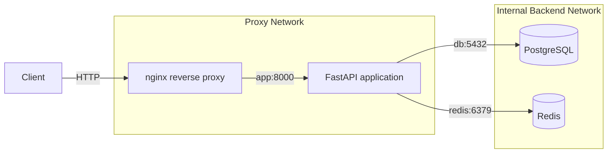
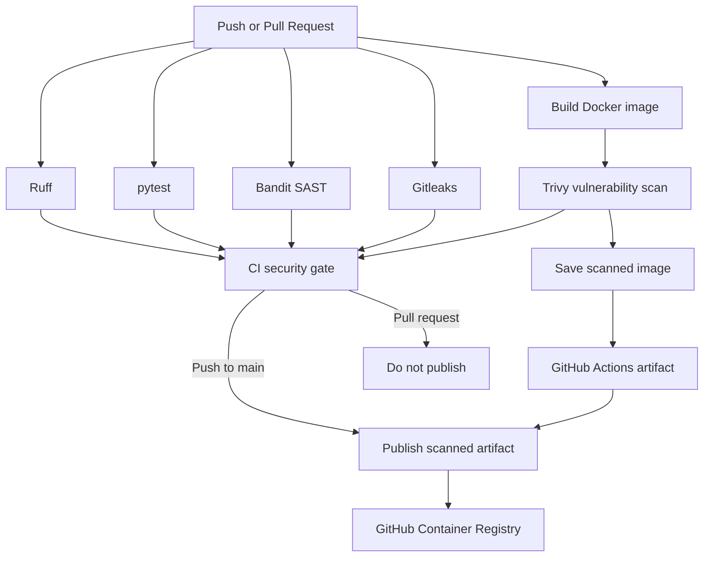

# AllSafe

[](https://github.com/aluetov/allsafe/actions/workflows/ci.yml)

# I dont fucking know what this project is about anymore, just have fun!!!3

AllSafe is a containerized passive DNS reconnaissance API built with FastAPI.

The application accepts a domain name, resolves its DNS `A` records, caches results in Redis, and stores scan history in PostgreSQL. nginx acts as the only externally exposed entry point.

The project demonstrates production-style container infrastructure and a security-gated CI/CD pipeline, including service isolation, caching, persistence, health checks, multi-stage builds, non-root execution, automated testing, static analysis, secret scanning, container vulnerability scanning, and publishing validated Docker images to GitHub Container Registry.

> If the GitHub Actions workflow file is not named `ci.yml`, update the badge URL above to use the actual workflow filename.

## Current Features

- FastAPI REST API
- Asynchronous DNS resolution with `dnspython`
- PostgreSQL scan history
- Redis cache-aside pattern
- Redis TTL-based cache expiration
- nginx reverse proxy
- Docker Compose orchestration
- Docker health checks
- Named Docker volumes
- Separate proxy and backend networks
- Multi-stage Docker image
- Non-root application container
- Environment-based configuration
- GitHub Actions CI/CD
- Ruff linting and formatting checks
- pytest automated tests
- Bandit static application security testing
- Gitleaks secret scanning
- Docker image vulnerability scanning with Trivy
- Security-gated image publication
- GitHub Container Registry publishing
- Commit-SHA Docker image tags
- Exact scanned-artifact promotion between CI jobs
- Least-privilege GitHub Actions permissions

TLS certificate inspection and HTTP security-header grading are planned for a later application version.

The current application focuses on DNS reconnaissance, while the infrastructure and CI/CD layers provide container isolation, automated testing, security scanning, and controlled image publication.

## Architecture



Only nginx publishes a port to the host.

The FastAPI application, PostgreSQL, and Redis are accessible only through Docker networks.

## CI/CD Architecture

Pull requests targeting `main` pass through automated quality and security checks before they can be merged.



The pipeline covers several layers:

```text
Ruff
  ↓
Code quality and formatting

pytest
  ↓
Application behavior

Bandit
  ↓
Python static security analysis

Gitleaks
  ↓
Secret detection

Docker build
  ↓
Production container image

Trivy
  ↓
OS and application dependency vulnerability scanning

GHCR
  ↓
Validated container image publication
```

Pull requests are built, tested, and scanned but are not published.

After a change is merged into `main`, the workflow runs again for the resulting push to `main`.

If all required jobs succeed, the exact Docker image that passed Trivy is published to GitHub Container Registry.

## Request Flow

### New scan

```text
Client
  |
  v
nginx
  |
  v
FastAPI
  |
  +--> Check Redis
           |
           +--> Cache hit: return cached DNS result
           |
           +--> Cache miss
                    |
                    +--> Resolve DNS
                    +--> Save result in Redis
                    +--> Save scan history in PostgreSQL
                    +--> Return result
```

### Stored-domain lookup

The `/check/{domain}` endpoint first checks Redis.

If the result is not cached, the application reads the latest matching record from PostgreSQL and adds it back to Redis.

## Technology Stack

| Component | Technology |
|---|---|
| API | FastAPI |
| Application server | Uvicorn |
| DNS resolution | dnspython |
| Database | PostgreSQL |
| ORM | SQLAlchemy async |
| Database driver | asyncpg |
| Cache | Redis |
| Reverse proxy | nginx |
| Migrations | Alembic |
| Containerization | Docker |
| Orchestration | Docker Compose |
| CI/CD | GitHub Actions |
| Linting / formatting | Ruff |
| Testing | pytest |
| SAST | Bandit |
| Secret scanning | Gitleaks |
| Container vulnerability scanning | Trivy |
| Container registry | GitHub Container Registry |

## Project Structure

```text
.
├── .dockerignore
├── .env.example
├── .github
│   └── workflows
│       └── ci.yml
├── .gitignore
├── Dockerfile
├── README.md
├── alembic
│   ├── README
│   ├── env.py
│   ├── script.py.mako
│   └── versions
├── alembic.ini
├── app
│   ├── __init__.py
│   ├── db
│   │   ├── __init__.py
│   │   ├── db.py
│   │   └── models.py
│   ├── main.py
│   ├── redis
│   │   ├── __init__.py
│   │   └── redis.py
│   └── routers
│       ├── __init__.py
│       └── scanner.py
├── compose.yaml
├── nginx
│   └── default.conf
├── requirements-dev.txt
├── requirements.txt
└── tests
```

Adjust the workflow filename in this tree if the repository uses a name other than `ci.yml`.

## Requirements

Install:

- Docker
- Docker Compose
- Git

No local Python installation is required to run the containerized stack.

## Local Setup

Clone the repository:

```bash
git clone https://github.com/aluetov/allsafe.git
cd allsafe
```

Create the local environment file:

```bash
cp .env.example .env
```

Review and change the values inside `.env`.

Example:

```dotenv
# PostgreSQL
DB_HOST=db
DB_PORT=5432
DB_NAME=allsafe
DB_USER=allsafe
DB_PASSWORD=change-me

# Redis
REDIS_HOST=redis
REDIS_PORT=6379

# nginx
NGINX_HOST_PORT=8080
NGINX_PORT=80
```

Do not commit the real `.env` file.

## Start the Application

Build the application image and start all services:

```bash
docker compose up --build -d
```

Check container status:

```bash
docker compose ps
```

View application logs:

```bash
docker compose logs -f app
```

Open the health endpoint:

```bash
curl http://localhost:8080/health
```

Expected response:

```json
{
  "status": "healthy"
}
```

When `NGINX_HOST_PORT` is set to `80`, use:

```bash
curl http://localhost/health
```

## API Endpoints

### `GET /`

Returns a basic application response.

```bash
curl http://localhost:8080/
```

Example response:

```json
{
  "message": "Hello, World!"
}
```

### `GET /health`

Checks whether the FastAPI application is responding.

```bash
curl http://localhost:8080/health
```

Example response:

```json
{
  "status": "healthy"
}
```

### `POST /scan`

Resolves the domain's DNS `A` records.

```bash
curl -X POST http://localhost:8080/scan \
  -H "Content-Type: application/json" \
  -d '{"domain":"example.com"}'
```

Example response:

```json
{
  "qname": "example.com.",
  "canonical_name": "example.com.",
  "record_type": "A",
  "record_class": "IN",
  "expiration": 1785940000.123,
  "records": [
    "93.184.216.34"
  ]
}
```

The exact IP addresses and expiration value depend on the live DNS response.

The first request normally produces a cache miss. Repeating the same request within the Redis TTL should produce a cache hit.

View the logs:

```bash
docker compose logs app
```

Expected log sequence:

```text
Cache MISS
Cache hit
```

### `GET /check/{domain}`

Checks whether a domain result exists in Redis or PostgreSQL.

```bash
curl http://localhost:8080/check/example.com
```

Redis response example:

```json
{
  "source": "redis",
  "ttl": 240,
  "cached_response": {
    "qname": "example.com.",
    "canonical_name": "example.com.",
    "record_type": "A",
    "record_class": "IN",
    "expiration": 1785940000.123,
    "records": [
      "93.184.216.34"
    ]
  }
}
```

PostgreSQL response example:

```json
{
  "source": "postgres",
  "data": {
    "qname": "example.com.",
    "canonical_name": "example.com.",
    "record_type": "A",
    "record_class": "IN",
    "expiration": 1785940000.123,
    "records": [
      "93.184.216.34"
    ]
  }
}
```

## Docker Services

### `nginx`

nginx is the only service that publishes a host port.

It receives external HTTP requests and forwards them to:

```text
app:8000
```

### `app`

The FastAPI application:

- processes API requests;
- performs asynchronous DNS resolution;
- communicates with Redis;
- writes scan history to PostgreSQL;
- runs as a dedicated non-root user.

### `db`

PostgreSQL stores scan history.

The application connects to it using:

```text
db:5432
```

The hostname is `db` because Docker Compose provides internal DNS resolution using service names.

### `redis`

Redis caches DNS responses using keys such as:

```text
dns:example.com
```

Cached entries expire after 300 seconds.

## Docker Networks

The stack uses two networks.

### Proxy network

Connected services:

- nginx
- app

This allows nginx to forward traffic to the FastAPI application.

### Backend network

Connected services:

- app
- db
- redis

The backend network is internal.

nginx cannot directly communicate with PostgreSQL or Redis because it does not share the backend network.

## Persistent Storage

The project uses named volumes:

```yaml
volumes:
  redis-data:
  db-data:
```

PostgreSQL and Redis data survive:

```bash
docker compose down
docker compose up -d
```

To stop the stack without deleting stored data:

```bash
docker compose down
```

To delete containers and named volumes:

```bash
docker compose down -v
```

Warning: `-v` permanently deletes the PostgreSQL and Redis volume data.

## Health Checks

PostgreSQL is checked with:

```bash
pg_isready
```

Redis is checked with:

```bash
redis-cli ping
```

The FastAPI service is checked through:

```text
http://127.0.0.1:8000/health
```

The application starts only after PostgreSQL and Redis are healthy.

nginx waits for the application health check before starting.

This avoids the common problem where a container process has started but the service is not yet ready to accept connections.

## Multi-Stage Docker Build

The Dockerfile contains two stages.

### Builder stage

The builder stage:

- creates a Python virtual environment;
- installs dependencies;
- prepares the runtime Python environment.

### Runtime stage

The runtime stage:

- starts from a clean Python slim image;
- copies the virtual environment from the builder;
- copies the application source;
- creates a dedicated service user;
- runs Uvicorn as a non-root user.

This separates dependency installation from the final runtime environment.

## Non-Root Execution

The application runs as the `allsafe` user instead of root.

Verify it with:

```bash
docker compose exec app whoami
```

Expected:

```text
allsafe
```

Inspect the full Linux identity:

```bash
docker compose exec app id
```

Running as a non-root user follows the principle of least privilege and limits the effect of an application compromise.

## CI Pipeline

The GitHub Actions workflow runs on:

```text
pull request → main
push → main
```

The following jobs run independently:

### Ruff

Ruff checks Python code quality and formatting.

```bash
ruff check .
ruff format --check .
```

### pytest

pytest runs the automated test suite.

```bash
pytest -v
```

### Bandit

Bandit performs static application security testing against the Python application source.

```bash
bandit -r app
```

### Gitleaks

Gitleaks scans the repository and Git history for accidentally committed credentials and secrets.

The checkout step fetches the complete Git history so historical commits can also be analyzed.

### Trivy

The workflow builds the production Docker image and scans it with Trivy.

The scan includes:

```text
OS packages
+
application libraries
```

The current security gate focuses on fixable `CRITICAL` vulnerabilities.

A fixable critical vulnerability causes Trivy to exit with a non-zero status, which fails the GitHub Actions job.

The image is not published unless the required CI jobs succeed.

## Container Image Publishing

Validated application images are published to GitHub Container Registry.

Image format:

```text
ghcr.io/aluetov/allsafe:<commit-sha>
```

For example:

```text
ghcr.io/aluetov/allsafe:0123456789abcdef...
```

Each published image is tagged with the Git commit SHA associated with the workflow run.

This provides traceability:

```text
Git commit
    ↓
GitHub Actions workflow
    ↓
Docker image
    ↓
GHCR package
```

An available image can be pulled with:

```bash
docker pull ghcr.io/aluetov/allsafe:<commit-sha>
```

Private packages require authentication before pulling.

## Exact Artifact Promotion

The pipeline follows a build-once model.

```text
Docker build
     ↓
Docker image
     ↓
Trivy scan
     ↓
docker save
     ↓
allsafe-image.tar
     ↓
GitHub Actions artifact storage
     ↓
publish job
     ↓
docker load
     ↓
docker push
     ↓
GHCR
```

The publish job does not rebuild the application image.

After Trivy successfully scans the image, `docker save` serializes that image into an archive:

```bash
docker save ghcr.io/aluetov/allsafe:<sha> -o allsafe-image.tar
```

The archive is uploaded to GitHub Actions artifact storage.

The publishing job downloads that artifact and restores the Docker image:

```bash
docker load -i allsafe-image.tar
```

The restored image is then pushed directly to GHCR.

This ensures that the image published to the registry is the same artifact that passed vulnerability scanning.

## Publishing Policy

Pull requests are never published as official container images.

For a pull request:

```text
PR → main
   ↓
Ruff
pytest
Bandit
Gitleaks
Docker build
Trivy
   ↓
validation only
   ↓
no GHCR publication
```

After the pull request is merged:

```text
merge into main
      ↓
push event on main
      ↓
CI runs again
      ↓
all required checks succeed
      ↓
publish job
      ↓
GHCR
```

This prevents unmerged feature branches from publishing official application images.

## GitHub Actions Permissions

The workflow follows the principle of least privilege.

Most jobs use:

```yaml
permissions:
  contents: read
```

They only need to read the repository.

The publishing job receives:

```yaml
permissions:
  contents: read
  packages: write
```

`packages: write` is required to publish the validated image to GitHub Container Registry.

Publishing privileges are therefore limited to the job that actually needs them.

## Security Decisions

### Only nginx is exposed

The FastAPI application, PostgreSQL, and Redis do not publish host ports.

External requests must pass through nginx.

### Secrets are excluded from Git

The real `.env` file is ignored through `.gitignore`.

The repository contains `.env.example` with placeholder values.

### Secrets are excluded from Docker builds

`.dockerignore` excludes `.env`, local virtual environments, Git metadata, and Python cache files from the Docker build context.

### Application runs as non-root

Uvicorn runs as a dedicated Linux service user.

### Backend network is internal

PostgreSQL and Redis are isolated from direct external access.

### Security-gated CI

Changes targeting `main` are automatically checked with Ruff, pytest, Bandit, Gitleaks, and Trivy.

Publishing depends on successful completion of the required CI jobs.

### Static application security testing

Bandit analyzes Python source code for potentially insecure programming patterns.

### Secret scanning

Gitleaks scans the repository for accidentally committed credentials and other secrets.

The real `.env` remains excluded from Git.

### Container vulnerability scanning

Trivy scans the final application image for known vulnerabilities in operating-system packages and application libraries.

The current CI policy blocks fixable `CRITICAL` vulnerabilities.

Unfixed vulnerabilities are ignored by the blocking rule because there is no currently available remediation version.

### Least-privilege CI permissions

Most jobs receive read-only repository permissions.

Only the publishing job receives permission to write packages to GHCR.

### Exact artifact promotion

The Docker image is built and scanned once.

After Trivy succeeds, that image is transferred between jobs using a GitHub Actions artifact and published without rebuilding it.

This reduces the possibility of differences between the scanned artifact and the published artifact.

### Immutable action references

Security-sensitive third-party GitHub Actions such as Trivy and the Docker registry login action are pinned to specific Git commit SHAs instead of movable version tags.

This reduces exposure to changes in third-party action tags.

## Verification Commands

Validate the Compose configuration:

```bash
docker compose config
```

Build the application image:

```bash
docker compose build app
```

Start the complete stack:

```bash
docker compose up -d
```

Check service status:

```bash
docker compose ps
```

Verify the application user:

```bash
docker compose exec app whoami
```

Test the API through nginx:

```bash
curl http://localhost:8080/health
```

Confirm that the API is not published directly:

```bash
curl --connect-timeout 2 http://localhost:8000/health
```

The direct request should fail when only nginx exposes a host port.

## Persistence Test

Create a scan:

```bash
curl -X POST http://localhost:8080/scan \
  -H "Content-Type: application/json" \
  -d '{"domain":"example.org"}'
```

Restart the stack:

```bash
docker compose down
docker compose up -d
```

Clear Redis:

```bash
docker compose exec redis redis-cli FLUSHALL
```

Request the stored record:

```bash
curl http://localhost:8080/check/example.org
```

The response should report:

```json
{
  "source": "postgres"
}
```

This proves that the PostgreSQL named volume preserved the scan history.

## Clean-Clone Test

A successful clean-clone test proves that the repository does not depend on hidden local files.

```bash
git clone https://github.com/aluetov/allsafe.git
cd allsafe
cp .env.example .env
docker compose up --build -d
docker compose ps
curl http://localhost:8080/health
```

The project is considered reproducible when this process works on a clean machine with only Docker, Docker Compose, and Git installed.

## Useful Commands

Start in attached mode:

```bash
docker compose up --build
```

Start in detached mode:

```bash
docker compose up --build -d
```

Follow application logs:

```bash
docker compose logs -f app
```

Rebuild only the application image:

```bash
docker compose build app
```

Rebuild without using cached Dockerfile layers:

```bash
docker compose build --no-cache app
```

Open a shell inside the running application container:

```bash
docker compose exec app sh
```

Stop the stack:

```bash
docker compose down
```

Stop the stack and delete volumes:

```bash
docker compose down -v
```

Pull a published image from GHCR:

```bash
docker pull ghcr.io/aluetov/allsafe:<commit-sha>
```

## Project Progress

### Phase 1 — Container Infrastructure ✅

Completed:

- multi-service Docker Compose stack;
- nginx reverse proxy;
- PostgreSQL persistence;
- Redis cache-aside;
- service health checks;
- isolated Docker networks;
- multi-stage application image;
- non-root execution;
- environment-based configuration;
- clean-clone reproducibility.

### Phase 2 — Security-Gated CI/CD ✅

Completed:

- Ruff linting and formatting;
- pytest automated testing;
- Bandit SAST;
- Gitleaks secret scanning;
- Docker image builds in CI;
- Trivy vulnerability scanning;
- blocking policy for fixable critical vulnerabilities;
- commit-SHA image tagging;
- exact scanned-artifact promotion;
- GHCR authentication with `GITHUB_TOKEN`;
- least-privilege package publishing;
- container publication only from `main`.

### Next Phase

The next phase will focus on infrastructure provisioning and deployment:

- Terraform;
- remote infrastructure;
- host hardening;
- automated deployment;
- HTTPS;
- production configuration.

## Lessons Learned

- Containers are running instances of images.
- Docker Compose manages multiple related services.
- Services communicate through Compose service names instead of `localhost`.
- Named volumes persist data independently of containers.
- `depends_on` alone does not guarantee service readiness.
- Health checks provide readiness-aware startup ordering.
- Redis cache-aside reduces repeated external work.
- nginx provides a controlled external entry point.
- Multi-stage builds separate build and runtime concerns.
- Non-root execution applies the principle of least privilege.
- `.gitignore` and `.dockerignore` solve different problems.
- A clean-clone test proves that setup does not depend on hidden local state.
- GitHub Actions jobs run on isolated runners and do not automatically share files or Docker images.
- GitHub Actions artifacts can transfer build artifacts between jobs.
- Static analysis, secret scanning, testing, and container vulnerability scanning protect different layers of the software supply chain.
- A vulnerability scanner and a CI security gate are different: the scanner reports findings while exit codes determine whether the pipeline fails.
- Vulnerability severity alone is not always enough when defining policy; fix availability also matters.
- `GITHUB_TOKEN` provides temporary workflow authentication and should receive only the permissions required by each job.
- Pull requests should validate artifacts without publishing official images.
- Commit-SHA image tags provide traceability between source code and container artifacts.
- Building once and publishing the exact scanned artifact avoids differences between the tested and released image.
- Third-party GitHub Actions are executable supply-chain dependencies and can be pinned to immutable Git commit SHAs.
- CI validates changes before integration, while later pipeline stages can promote validated artifacts toward deployment.

## License

This project is currently intended for educational and portfolio use.