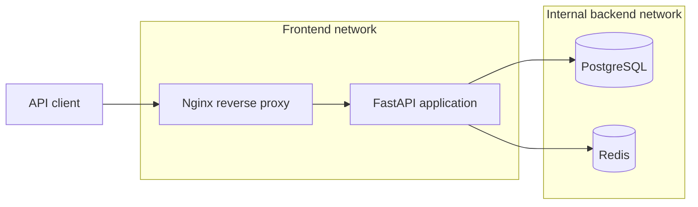

# AllSafe

[](https://github.com/aluetov/allsafe/actions/workflows/CI.yaml)

AllSafe is an asynchronous FastAPI backend for a multiplayer chat-elimination game. It currently provides user authentication, lobby management, and concurrency-aware public matchmaking on top of PostgreSQL.

The repository name is historical. The original DNS scanner is preserved in the [`allsafe-scanner-v1`](https://github.com/aluetov/allsafe/tree/allsafe-scanner-v1) tag; it is not the application exposed by the current code.

> **Project status:** Active development. Authentication, game creation, lobby membership, and matchmaking are implemented. Real-time chat, game rounds, voting, and elimination flows are not implemented yet.

## Current Features

- asynchronous FastAPI request handling;
- user registration and login;
- Argon2 password hashing;
- expiring JWT bearer tokens;
- protected user and game endpoints;
- private game creation;
- waiting-game discovery;
- join and leave operations for waiting lobbies;
- automatic public matchmaking;
- transaction and row-lock based concurrency control;
- PostgreSQL advisory locking for public matchmaking;
- PostgreSQL persistence through SQLAlchemy 2.0 and AsyncPG;
- Alembic database migrations;
- Pydantic request validation;
- PostgreSQL constraints for game and voting rules;
- Docker Compose orchestration;
- Nginx reverse proxy;
- container health checks and persistent volumes;
- multi-stage, non-root application image;
- GitHub Actions quality and security checks;
- conditional image publication to GitHub Container Registry.

## Architecture



Nginx is the HTTP entry point. The application communicates with PostgreSQL and Redis through an internal Docker network. PostgreSQL is also bound to `127.0.0.1` for local database administration.

Redis is initialized by the application and included in the container stack, but current game endpoints do not store game state or matchmaking data in Redis yet.

The supplied Compose configuration is intended for local development. It uses source bind mounts and starts Uvicorn with reload enabled.

## Technology Stack

| Area | Technology |
|---|---|
| API | FastAPI, Uvicorn, Pydantic |
| Authentication | JWT, pwdlib, Argon2 |
| Database | PostgreSQL, SQLAlchemy 2.0, AsyncPG |
| Migrations | Alembic |
| Cache / future real-time support | Redis |
| Proxy | Nginx |
| Containers | Docker, Docker Compose |
| Testing and style | pytest, Ruff |
| Security checks | Bandit, Gitleaks, Trivy |
| CI/CD | GitHub Actions, GitHub Container Registry |

## API Overview

Interactive documentation is available at `/docs` after the stack starts.

| Method | Path | Authentication | Description |
|---|---|---|---|
| `GET` | `/` | No | Basic application response |
| `GET` | `/health` | No | Application health check |
| `POST` | `/register` | No | Create a user account |
| `POST` | `/login` | No | Exchange credentials for a JWT |
| `GET` | `/users/me` | Bearer token | Return the current user |
| `POST` | `/games` | Bearer token | Create a private game and join it as owner |
| `GET` | `/games` | No | List waiting games with player counts |
| `POST` | `/games/{game_id}/join` | Bearer token | Join a waiting game |
| `POST` | `/games/{game_id}/leave` | Bearer token | Leave a waiting game |
| `POST` | `/games/play` | Bearer token | Join or create a public game |

## Data Model

The active game schema contains the following entities:

- `users` - accounts and password hashes;
- `games` - access type, status, capacity, owner, and timestamps;
- `game_players` - game membership and player state;
- `rounds` - round lifecycle and timing fields;
- `messages` - user and system messages;
- `votes` - one vote per player per round.

Important rules are enforced in both request validation and PostgreSQL constraints. Examples include player-capacity limits, unique game membership, private-game ownership, positive round numbers, and prevention of self-voting.

## Matchmaking Concurrency

`POST /games/play` is designed to avoid duplicate membership and overfilled public lobbies when requests arrive concurrently.

The service:

1. returns an existing waiting public game when the user already belongs to one;
2. acquires a transaction-level PostgreSQL advisory lock;
3. checks again after acquiring the lock;
4. locks and selects the oldest public game with available capacity, or creates one;
5. inserts the player and commits the transaction.

Database uniqueness constraints provide a final safeguard against duplicate membership.

## Getting Started

### Prerequisites

- Git;
- Docker;
- Docker Compose.

### 1. Clone the repository

```bash
git clone https://github.com/aluetov/allsafe.git
cd allsafe
```

### 2. Configure the environment

Create a local environment file:

```bash
cp .env.example .env
```

Ensure `.env` contains all required settings:

```dotenv
# PostgreSQL
DB_HOST=db
DB_PORT=5432
DB_NAME=allsafe
DB_USER=allsafe
DB_PASSWORD=change-me
DB_HOST_PORT=5433

# Redis
REDIS_HOST=redis
REDIS_PORT=6379

# Authentication
SIGNING_KEY=replace-with-a-long-random-secret
ALGORITHM=HS256

# Nginx
NGINX_PORT=80
NGINX_HOST_PORT=80
```

Use a strong, unique signing key outside local development. Do not commit `.env`.

### 3. Start the stack

```bash
docker compose up --build -d
```

Apply the database migrations:

```bash
docker compose exec app alembic upgrade head
```

Check service status:

```bash
docker compose ps
```

### 4. Verify the application

With the default `NGINX_HOST_PORT=80`:

```bash
curl http://localhost/health
```

Expected response:

```json
{"status":"healthy"}
```

Open the API documentation at [http://localhost/docs](http://localhost/docs).

If you change `NGINX_HOST_PORT`, include that port in the URL, for example `http://localhost:8080/docs`.

## Authentication Example

Register a user:

```bash
curl -X POST http://localhost/register \
  -H "Content-Type: application/json" \
  -d '{"username":"player_one","password":"change-this-password"}'
```

Log in:

```bash
curl -X POST http://localhost/login \
  -H "Content-Type: application/json" \
  -d '{"username":"player_one","password":"change-this-password"}'
```

The login response contains an access token:

```json
{
  "access_token": "<jwt>",
  "token_type": "bearer"
}
```

Use the token on protected endpoints:

```bash
curl http://localhost/users/me \
  -H "Authorization: Bearer <jwt>"
```

Join public matchmaking:

```bash
curl -X POST http://localhost/games/play \
  -H "Authorization: Bearer <jwt>"
```

Create a private game:

```bash
curl -X POST http://localhost/games \
  -H "Authorization: Bearer <jwt>" \
  -H "Content-Type: application/json" \
  -d '{"min_players":5,"max_players":10}'
```

## Development Checks

Use Python 3.14 when running the project tooling outside Docker.

Create a Python environment and install the development dependencies:

```bash
python3 -m venv venv
source venv/bin/activate
python -m pip install -r requirements-dev.txt
```

Run the local checks:

```bash
ruff check .
ruff format --check .
pytest -v
bandit -r app
```

Generate a new migration after changing SQLAlchemy models:

```bash
docker compose exec app alembic revision --autogenerate -m "describe the change"
docker compose exec app alembic upgrade head
```

## Docker Services

| Service | Role | Host access |
|---|---|---|
| `nginx` | Reverse proxy | Published through `NGINX_HOST_PORT` |
| `app` | FastAPI / Uvicorn | Internal only |
| `db` | PostgreSQL | Bound to `127.0.0.1:DB_HOST_PORT` |
| `redis` | Redis server | Internal only |

Named volumes preserve PostgreSQL and Redis data across container restarts.

Useful commands:

```bash
docker compose logs -f app
docker compose exec app alembic current
docker compose down
```

To remove the containers and stored database/cache volumes:

```bash
docker compose down -v
```

The `-v` option permanently deletes local PostgreSQL and Redis data.

## CI/CD

The GitHub Actions workflow runs on pushes and pull requests targeting `main`.

It performs:

- Ruff linting and format verification;
- pytest execution;
- Bandit static application security testing;
- Gitleaks secret scanning;
- Docker image construction;
- Trivy scanning for fixable critical vulnerabilities.

On a successful push to `main`, the publish job loads the exact image artifact scanned by Trivy and pushes it to:

```text
ghcr.io/aluetov/allsafe:<commit-sha>
```

Pull requests are validated but never published. Most jobs have read-only repository permissions; package-write permission is limited to the publishing job.

## Project Structure

```text
.
|-- .github/workflows/CI.yaml
|-- alembic/
|   |-- env.py
|   `-- versions/
|-- app/
|   |-- core/          # configuration and security helpers
|   |-- db/            # async database setup and SQLAlchemy models
|   |-- dependencies/  # FastAPI dependencies
|   |-- game/          # game rules, errors, and service layer
|   |-- redis/         # Redis client setup
|   |-- routers/       # auth, user, and game endpoints
|   |-- schemas/       # Pydantic request and response models
|   `-- main.py
|-- nginx/default.conf
|-- tests/
|-- compose.yaml
|-- Dockerfile
|-- pyproject.toml
|-- requirements.txt
`-- requirements-dev.txt
```

## Planned Work

- ready-state and game-start transitions;
- WebSocket-based chat;
- round state management;
- voting, tiebreaking, and elimination services;
- winner calculation and end-game flow;
- Redis integration for real-time or ephemeral state;
- endpoint and concurrency integration tests;
- production server configuration, TLS, and deployment automation.

## Legacy DNS Scanner

The first version of AllSafe was an asynchronous DNS `A`-record scanner with Redis TTL caching and PostgreSQL history. That implementation is available in the [`allsafe-scanner-v1`](https://github.com/aluetov/allsafe/tree/allsafe-scanner-v1) tag.

The current application does not expose the legacy `/scan` or `/check/{domain}` endpoints.

## License

This repository is currently intended for educational and portfolio use. No open-source license has been added yet.
